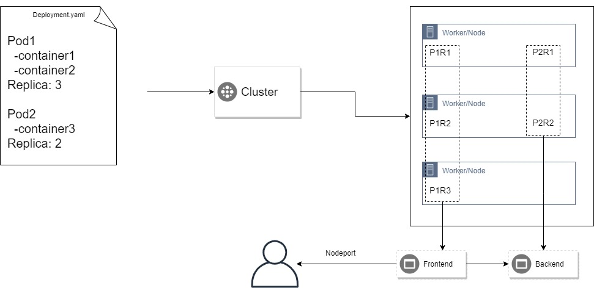
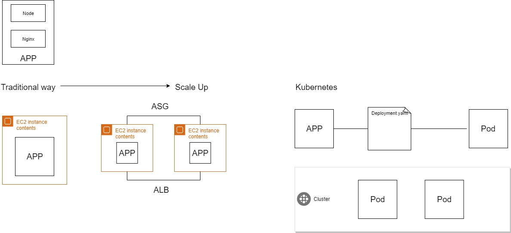

# DevOps-Kubernetes
Learning notes for DevOps - Kubernetes

## What's Kubernetes

## Kubernetes vs traditional

## Resources
https://www.youtube.com/watch?v=PH-2FfFD2PU&t=18s
https://www.youtube.com/watch?v=aSrqRSk43lY
